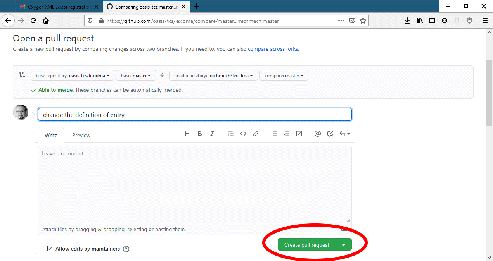

This document walks you through the entire process of editing the DMLex specification: forking it on GitHub, getting it onto your computer, editing and previewing it in Oxygen, and eventually pushing it back to GitHub.

It assumes you are using Windows.

Author: Michal Měchura, michmech@lexiconista.com  
Last update: 12 April 2021

# 1. GitHub

## 1.1. Create a GitHub account

Go to https://github.com/ and create an account for yourself, if you don't have one already.

## 1.2. Understand GitHub accounts and repositories

In GitHub, every user account has a home page. There are two kinds of accounts: organization and personal.
- https://github.com/oasis-tcs/ is the home page of the OASIS account. It is an organization account.
- https://github.com/michmech/ is the home page of my account. It is a personal account. Yours will look similar.

Every GitHub account, regardless of whether organization or personal, can contain any number of repositories.
A repository is a place where you can store files and folders.
- https://github.com/oasis-tcs/lexidma is the repository which contains the files relevant to LEXIDMA.

## 1.3. Create a fork of the LEXIDMA repository

Go to the LEXIDMA repository and click the Fork button. This will create a fork (which is a fancy GitHub word for copy) of the LEXIDMA repository in your account.


Your fork will have a URL like https://github.com/michmech/lexidma

Note: the home page of your fork, and the home page of the repository from which you forked it, look pretty much identical.
Always look in the top-left corned to clarify for yourself which one you're looking at, the fork or the original.


The fork you have created is your repository. You can do anything you want to the files in that repository. It will have no effect on the original repository.

# 2. GitHub Desktop

To make changes to files in your fork of the LEXIDMA repository, you need to clone it from GitHub's server to your local machine.
Cloning is another fancy GitHub word for making a copy.
Cloning means creating a local copy of a remote repository, where local means on your computer and remote means on GitHub's servers.
You will use a software package called GitHub Desktop for that.

## 2.1. Install GitHub Desktop

Go to https://desktop.github.com/ to download and install GitHub Desktop.

## 2.2. Connect GitHub Desktop to your GitHub account

In GitHub Desktop, go to File > Options and log in to your GitHub account from there.


## 2.3. Clone your LEXIDMA repository

Click File > Clone repository and clone your LEXIDMA repository into a folder somewhere on your computer. (Note: if GitHub Desktop asks you at this point "what you want to do with this repository", answer that it's "for my own purposes".)


From now on GitHub Desktop will look after synchronizing your local clone of the repository with the remote one on the server.

# 3. Understand the LEXIDMA repository

The specification document which we are supposed to be editing lives in the repository's `\dmlex-v1.0\specification` subfolder. It is not a single file but a large collection of files (in DocBook XML format) which can eventually be compiled into a single file for viewing and reading.


The "main" file here is `dmlex.xml`. It contains some text plus instructions for including other files, which contain even more text (and sometimes instructions for including other files again). These other files live in the various subfolders under `\dmlex-v1.0\specification`.

Compiling this into a single file for viewing and reading is a two-step process:

1. First you or someone needs to *merge* the various "other" files into the main file. This can be done by running a script. I will show you later how. The result of this step will be one huge XML file named `dmlex-v1.0-wd01.xml`.

2. Then you or someone needs to transform this huge XML file into an HTML file. This can be done by applying an XSL stylesheet onto the XML file. I will show you later how to do this in Oxygen. The result of this step will be an HTML file called `dmlex-v1.0-wd01.html`.

We will do these steps together later. For now, remember this:

- To view and read the document, open `dmlex-v1.0-wd01.html` in your web browser. You can read the entire specification, from start to end, in that one file.

- To edit the document, edit `dmlex.xml` and all the "other" files included in it. Do not edit `dmlex-v1.0-wd01.xml`, as that is just a transient temp file used during the compilation process.

# 4. Oxygen

## 4.1 Finding out which file to edit

Let's say you want to edit the description of the `entry` object in the DMLex standard.


When you open `dmlex.xml` in Oxygen and switch to XML view, you will see that, in addition to text with XML markup, the file contains instructions like these for adding other XML files:

```xml
<xi:include href="objects/objects.xml" xmlns:xi="http://www.w3.org/2001/XInclude"/>
```

This means that the file `objects.xml` from the folder `objects` is to be inserted at that point. So you can open `objects.xml` in Oxygen now and see what it contains. You will see that it, again, contains text with XML markup along with instructions for adding other XML files again, such as:

```xml
<xi:include href="structural.xml" xmlns:xi="http://www.w3.org/2001/XInclude"/>
```

And this file, `structural.xml`, also includes in itself a number of other files, such as this one:

```xml
<xi:include href="structural/entry.xml" xmlns:xi="http://www.w3.org/2001/XInclude"/>
```

And this file, `entry.xml`, finally, contains the text which describes the `entry` object in the DMLex standard: this is what you want to edit.

## 4.2. Merge the XML files into one

After you have edited something you probably want to compile the document. This is a two-step process, as explained above: first you need to merge the individual XML files into one big one, then you need to transform that big XML file into a human-readable HTML file.

The first step is simple: open the command prompt, go to the `\lexidma\dmlex-v1.0\specification` folder on your computer, and run `merge.bat`. This creates or overwrites the file `dmlex-v1.0-wd01.xml`.


Note: If you get an error message that says "java is not recognized" or something to that effect, it means you don't have a Java runtime installed. Install it from https://java.com/en/download/windows_manual.jsp

## 4.3. Transform into HTML

Now, to produce a human-readable HTML rendition of the document, you need to apply an XSL stylesheet on to the big XML file created in the previous step. The XSl stylesheet you need to use is `oasis-specification-html-offline.xsl` in the `stylesheets` folder. Here is how you get Oxygen to do that transformation:

1. Open `dmlex-v1.0-wd01.xml` in Oxygen.


2. Click the *Configure Transformation Scenarios* button. A window pops up.


3. In this window click *New* and then *XML Transformation with XSLT*. Another window pops up.

4. In this window, locate the XSL file `stylesheets\oasis-specification-html-offline.xsl` in the *XSL URL* field. Leave everything else unchanged.


5. In the same window, go to the *Output* tab and, in the *Save as* field, locate the HTML which you to produce: `dmlex-v1.0-wd01.html`.


6. In the same window, click *OK*. The window closes and the one that was underneath it re-appears.


7. In this window click the *Apply associated* button.

After a while, Oxygen will show you some output in the bottom half of its screen (which you can ignore) and, importantly, it has saved the file `dmlex-v1.0-wd01.html`. You should be able to see your edits there when you open it in a web browser.

# 5. Back to GitHub Desktop

When you're finished editing (and previewing your edits) you can go back to GitHub Desktop. It shows you which files you have changed, and what exactly has changed. These changes are local, on your computer, in your local close of your GitHub repository. To get to your remote repository in GitHub, you need to first *commit* them and then *push* them.


1. To commit the changes, type a summary of the changes in the *Summary* box and press the blue button that says *Commit to master*. (Don't worry what "master" means here. OK, it's the name a branch in your repository. Seriously, you don't need to know that though.)


2. To push the changes you have just committed, click the *Push origin* button at the top (or the blue one underneath with the same caption, it doesn't matter).

Your changes have now been uploaded to your repository on GitHub. If you now go to the your repository homepage, you should see the summary of your changes there.


# 6. Back to GitHub

Your changes have now been uploaded into your repository. Remember that your repository is a fork (a copy) of the original OASIS LEXIDMA repository. Any changes you make to your fork do not affect the original repository. If you want to propagate your changes to the original repository, you need to submit something called a *pull request*.


1. At the top of the screen, GitHub is telling you how your forked repository is different from the original repository. Click *Pull request*


2. This takes you to a screen which summarizes the different between your form and the original, and gives you the chance to turn those differences into a pull request. Click the green button to start creating the pull request.



3. Finally, this takes you to a screen where can actually create the pull request. You have a chance to give your pull request a title and add a comment. If the pull request you are creating is based on just one commit, then GitHub will take the title from that and you can just accept it. Then click the green button to create the pull request.

You have now submitted a pull request from your form into the original repository. A pull request is basically saying "please take these changes from my repository and *pull* them into yours". The administrator of the OASIS LEXIDMA repository is now able to review your pull request and has the power to accept it or reject it.

You can always check on the status of your pull request by going to the OASIS LEXIDMA repository and clicking on the *Pull requests* tab. Your pull request will be listed there, among any others sent to this repository.

Phew!
